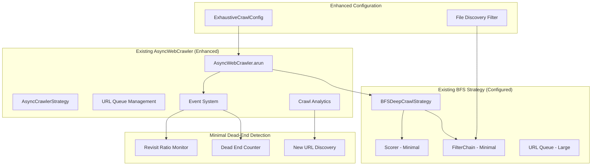

# Design Document

## CRITICAL: Crawl4AI Codebase Integration

**MANDATORY APPROACH**: This design leverages the complete Crawl4AI codebase available in this workspace:
- **NO external imports needed** - aiohttp, aiofiles, playwright, etc. already available
- **Extend existing classes** - AsyncWebCrawler, CrawlerRunConfig, AsyncCrawlerStrategy
- **Use existing patterns** - async operations, logging, configuration, session management
- **Follow existing conventions** - method naming, error handling, result structures

## Overview

The Domain Intelligence Crawler maximally leverages Crawl4AI's existing AsyncWebCrawler architecture to achieve exhaustive site mapping that "just keeps going until hitting dead ends." The design primarily configures existing components like BFSDeepCrawlStrategy, AdaptiveCrawler, and AsyncWebCrawler to create intelligent dead-end detection and comprehensive coverage behavior.

The system transforms the existing crawler into an exhaustive mapping system by configuring existing Crawl4AI components for "until dead ends" behavior while adding minimal new code for dead-end detection and file discovery integration.

## Architecture

### High-Level Architecture (Maximum AsyncWebCrawler Integration)



### Maximum AsyncWebCrawler Integration Strategy

The design maximally leverages existing AsyncWebCrawler for "crawl until dead ends" behavior:

1. **AsyncWebCrawler.arun()**: Use existing method as foundation with enhanced monitoring
2. **BFSDeepCrawlStrategy**: Configure existing strategy for exhaustive coverage (max_depth=100, max_pages=10000)
3. **Existing Event System**: Hook into existing on_page_processed and on_crawl_completed events for dead-end detection
4. **Existing URL Queue**: Leverage existing queue management with enhanced capacity (50000 URLs)
5. **Existing Analytics**: Use built-in crawl analytics for new URL discovery rate monitoring
6. **Minimal Filtering**: Configure existing FilterChain with minimal restrictions for maximum discovery
7. **Existing Database**: Use async_db_manager patterns for discovered URL tracking

## Components and Interfaces

### 1. ExhaustiveCrawlConfig (Existing Component Extension)

**Purpose**: Extend existing CrawlerRunConfig for "crawl until dead ends" behavior.

**Implementation**: Add new fields to existing CrawlerRunConfig class for exhaustive crawling.

```python
@dataclass
class ExhaustiveCrawlConfig(CrawlerRunConfig):
    """Extend existing config for exhaustive crawling"""
    
    # Override existing limits for exhaustive behavior
    max_depth: int = 100  # Effectively "infinite" for most sites
    max_pages: int = 10000  # Very high limit
    max_concurrent_requests: int = 20  # Aggressive concurrency
    
    # New exhaustive behavior flags
    stop_on_dead_ends: bool = True  # Stop when no new URLs found
    dead_end_threshold: int = 50  # Consecutive dead pages before stopping
    revisit_ratio: float = 0.95  # Stop when 95% of URLs are revisits
    
    # Enhanced existing settings
    respect_robots_txt: bool = False  # Override for completeness
    delay_between_requests: float = 0.1  # Minimal politeness delay
    
    # File discovery integration
    discover_files_during_crawl: bool = True
    download_discovered_files: bool = True
```

**Key Responsibilities**:
- Configure existing AsyncWebCrawler for exhaustive behavior
- Set high limits that effectively mean "until dead ends"
- Enable dead-end detection through existing crawl monitoring

### 2. Exhaustive BFS Strategy Configuration (Existing Component Usage)

**Purpose**: Configure existing BFSDeepCrawlStrategy for "crawl until dead ends" behavior.

**Implementation**: Use existing BFS strategy with minimal filtering and high limits.

```python
def create_exhaustive_bfs_strategy():
    """Configure existing BFSDeepCrawlStrategy to crawl until dead ends"""
    return BFSDeepCrawlStrategy(
        max_depth=100,  # Very high limit - effectively "until dead ends"
        max_pages=10000,  # High page limit
        same_domain=True,  # Use existing domain restriction
        respect_robots_txt=False,  # Override for comprehensive coverage
        filter_chain=FilterChain([
            # Minimal filtering - let it discover everything
            URLPatternFilter(patterns=[".*"]),  # Allow all URLs
            ContentTypeFilter(allowed_types=[
                'text/html', 'application/pdf', 'text/plain',
                'application/json', 'text/xml', 'application/xml'
            ])
        ]),
        # Remove or minimize scoring to avoid premature stopping
        scorer=None,  # No scoring - crawl everything equally
        # Configure existing politeness settings for aggressive crawling
        delay_between_requests=0.1,  # Minimal delay
        max_concurrent_requests=20  # High concurrency
    )
```

**Integration Points**:
- Leverages existing BFSDeepCrawlStrategy with exhaustive parameters
- Uses existing FilterChain with minimal restrictions
- Configures existing URL queue for large capacity (50000 URLs)

### 3. Extended Database Schema (Existing Component Extension)

**Purpose**: Extend existing async_db_manager to track site mapping data.

**Implementation**: Add new tables to existing database schema rather than creating new system.

```python
# Extension to existing database schema
class SiteMappingDB:
    def __init__(self, db_manager):
        self.db = db_manager  # Use existing async_db_manager
        
    async def store_discovered_url(self, url: str, source_url: str, metadata: Dict) -> None:
        # Use existing database connection and patterns
        
    async def update_url_status(self, url: str, status_code: int, last_checked: datetime) -> None:
        # Leverage existing database operations
        
    async def get_site_graph(self, base_url: str) -> Dict:
        # Return site structure using existing query patterns
```

**Database Schema Extension**:
```sql
-- Extend existing database with new tables
CREATE TABLE IF NOT EXISTS discovered_urls (
    url TEXT PRIMARY KEY,
    source_url TEXT,
    discovered_at TIMESTAMP,
    last_checked TIMESTAMP,
    status_code INTEGER,
    content_type TEXT,
    file_size INTEGER,
    metadata TEXT  -- JSON
);
```

### 4. File Discovery Filter (New Minimal Component)

**Purpose**: Extend existing filter system to identify file download links.

**Implementation**: Create new filter that integrates with existing FilterChain.

```python
# New filter that extends existing filter architecture
class FileDiscoveryFilter(URLFilter):
    def __init__(self, file_extensions: List[str] = None):
        self.file_extensions = file_extensions or [
            '.pdf', '.doc', '.docx', '.xls', '.xlsx', '.ppt', '.pptx',
            '.zip', '.tar', '.gz', '.csv', '.json', '.xml'
        ]
        
    async def should_crawl(self, url: str, context: Dict) -> bool:
        # Use existing filter pattern to identify file URLs
        return any(url.lower().endswith(ext) for ext in self.file_extensions)
        
    def get_filter_stats(self) -> FilterStats:
        # Use existing FilterStats pattern
        return FilterStats(name="FileDiscovery", processed=self.processed, accepted=self.accepted)
```

**File Detection Strategies** (using existing patterns):
- Leverage existing URLPatternFilter for `/downloads/`, `/files/` patterns
- Use existing ContentTypeFilter for MIME type detection
- Extend existing link analysis in AsyncWebCrawler

### 5. Enhanced AsyncWebCrawler with Dead-End Detection (Minimal Extension)

**Purpose**: Extend existing AsyncWebCrawler with dead-end detection for exhaustive crawling.

**Implementation**: Add exhaustive crawling method that uses existing arun() as foundation.

```python
class ExhaustiveAsyncWebCrawler(AsyncWebCrawler):
    """Extend existing AsyncWebCrawler for exhaustive crawling"""
    
    def __init__(self, *args, **kwargs):
        super().__init__(*args, **kwargs)
        self.dead_end_counter = 0
        self.visited_urls = set()
        self.new_urls_found = 0
        
    async def arun_exhaustive(self, start_url: str, config: ExhaustiveCrawlConfig = None) -> CrawlResult:
        """Enhanced arun that crawls until hitting dead ends"""
        config = config or ExhaustiveCrawlConfig()
        
        while self.dead_end_counter < config.dead_end_threshold:
            # Use existing arun method but with enhanced monitoring
            result = await self.arun(start_url, config)
            
            # Analyze results using existing crawl analytics
            new_urls = await self._analyze_new_urls(result)
            
            if new_urls == 0:
                self.dead_end_counter += 1
            else:
                self.dead_end_counter = 0
                self.new_urls_found += new_urls
                
            # Check revisit ratio using existing URL tracking
            revisit_ratio = await self._calculate_revisit_ratio()
            if revisit_ratio >= config.revisit_ratio:
                break
                
            # Continue from newly discovered URLs
            start_url = await self._get_next_starting_url()
            
        return await self._compile_exhaustive_results()
```

**Integration with Existing Components**:
- Uses existing arun() method as foundation
- Leverages existing URL discovery and analytics
- Hooks into existing event system for monitoring

### 6. Existing Event System Integration for Dead-End Detection

**Purpose**: Hook into existing AsyncWebCrawler event system for dead-end detection.

**Implementation**: Use existing event handlers rather than creating new monitoring system.

```python
# Hook into existing AsyncWebCrawler events
def configure_exhaustive_event_handlers(crawler: AsyncWebCrawler):
    """Configure existing event system for dead-end detection"""
    
    # Use existing on_page_processed event
    @crawler.on_page_processed
    async def handle_page_processed(page: CrawledPage):
        # Analyze page for new URL discovery using existing analytics
        new_urls_found = await analyze_url_discovery_rate(page)
        
        if new_urls_found == 0:
            crawler.dead_end_counter += 1
        else:
            crawler.dead_end_counter = 0
            
    # Use existing on_crawl_completed event  
    @crawler.on_crawl_completed  
    async def handle_crawl_completed(result: CrawlResult):
        # Check if we should continue crawling using existing analytics
        if should_continue_crawling(result, crawler.dead_end_counter):
            await crawler.continue_from_discovered_urls()

def configure_adaptive_for_exhaustive_mode(adaptive_crawler: AdaptiveCrawler):
    """Configure existing AdaptiveCrawler for exhaustive behavior"""
    
    # Modify existing adaptive parameters for "until dead ends"
    adaptive_crawler.config.coverage_confidence_threshold = 0.99  # Almost certain
    adaptive_crawler.config.max_depth = 100
    adaptive_crawler.config.max_pages = 10000
    
    # Use existing statistical analysis to detect dead ends
    adaptive_crawler.dead_end_detection.enabled = True
    adaptive_crawler.dead_end_detection.consecutive_empty_pages = 50
    adaptive_crawler.dead_end_detection.revisit_threshold = 0.95
```

**Leveraging Existing Event System**:
- Uses existing on_page_processed and on_crawl_completed events
- Leverages existing crawl analytics for URL discovery monitoring
- Configures existing AdaptiveCrawler parameters for exhaustive behavior

## Data Models

### Domain Configuration

```python
@dataclass
class DomainConfig:
    domain_name: str
    content_patterns: Dict[str, Pattern]
    vocabulary: List[str]
    priority_areas: List[str]
    file_extensions: List[str]
    quality_criteria: Dict[str, Any]
    
@dataclass
class ContentPattern:
    url_patterns: List[str]
    content_indicators: List[str]
    exclusion_patterns: List[str]
    priority_score: float
```

### Site Graph Schema

```python
@dataclass
class SiteGraph:
    base_url: str
    discovered_urls: Dict[str, URLNode]
    link_relationships: List[LinkRelationship]
    file_inventory: Dict[str, FileMetadata]
    crawl_statistics: CrawlStatistics
    
@dataclass
class FileMetadata:
    url: str
    file_path: Optional[str]  # Local path if downloaded
    size: int
    content_type: str
    last_modified: Optional[datetime]
    download_status: DownloadStatus
    checksum: Optional[str]
```

### Enhanced Crawl Configuration

```python
@dataclass
class DomainIntelligentCrawlConfig(CrawlerRunConfig):
    # Existing CrawlerRunConfig fields...
    
    # New domain intelligence fields
    domain_config: Optional[DomainConfig] = None
    enable_file_discovery: bool = True
    enable_file_download: bool = True
    max_file_size: int = 100 * 1024 * 1024  # 100MB
    download_directory: str = "./downloads"
    site_mapping_strategy: str = "comprehensive"  # comprehensive, targeted, adaptive
    
    # File discovery settings
    file_extensions_whitelist: Optional[List[str]] = None
    file_extensions_blacklist: List[str] = field(default_factory=lambda: ['.exe', '.dmg'])
    max_concurrent_downloads: int = 5
    
    # Site mapping settings
    max_site_depth: int = 10
    respect_robots_txt: bool = True
    emulate_human_delays: bool = True
```

## Error Handling

### Robust Error Recovery

1. **Download Failures**:
   - Exponential backoff retry with jitter
   - Categorization of failure types (network, server, file not found)
   - Fallback strategies for different error conditions

2. **Site Mapping Errors**:
   - Graceful handling of broken links and redirects
   - Recovery from partial site map corruption
   - Continuation from last known good state

3. **Domain Intelligence Errors**:
   - Fallback to general crawling when domain patterns fail
   - Validation of domain configuration before crawling
   - Error reporting for pattern matching failures

### Error Classification System

```python
class CrawlError(Exception):
    def __init__(self, error_type: ErrorType, url: str, details: str):
        self.error_type = error_type
        self.url = url
        self.details = details
        
class ErrorType(Enum):
    NETWORK_ERROR = "network"
    SERVER_ERROR = "server"
    FILE_NOT_FOUND = "file_not_found"
    PERMISSION_DENIED = "permission_denied"
    INVALID_CONTENT = "invalid_content"
    STORAGE_ERROR = "storage"
```

## Testing Strategy

### Unit Testing

1. **Component Testing**:
   - Domain Intelligence System pattern matching
   - File Discovery Engine file type detection
   - Site Graph Builder URL relationship tracking
   - Download validation and integrity checking

2. **Integration Testing**:
   - End-to-end site mapping workflows
   - File discovery and download pipelines
   - Error handling and recovery scenarios
   - Performance under various site structures

### Test Data and Scenarios

1. **Mock Websites**:
   - Simple static sites with file downloads
   - Complex sites with dynamic content and APIs
   - Sites with various authentication mechanisms
   - Sites with different file organization patterns

2. **Performance Testing**:
   - Large site mapping (1000+ pages)
   - Concurrent file downloads
   - Memory usage during extended crawling
   - Database performance with large site graphs

### Validation Framework

```python
class SiteMappingValidator:
    def validate_completeness(self, site_graph: SiteGraph, expected_coverage: float) -> ValidationResult
    def validate_file_discovery(self, discovered_files: List[FileMetadata]) -> ValidationResult
    def validate_download_integrity(self, downloaded_files: List[str]) -> ValidationResult
```

## Performance Considerations

### Scalability Design

1. **Concurrent Operations**:
   - Parallel site mapping with configurable concurrency
   - Asynchronous file downloads with semaphore control
   - Efficient database operations with connection pooling

2. **Memory Management**:
   - Streaming processing for large site graphs
   - Lazy loading of file metadata
   - Periodic cleanup of completed download tasks

3. **Storage Optimization**:
   - Efficient site graph storage using graph databases
   - File deduplication based on content hashes
   - Compressed storage for large file collections

### Performance Monitoring

```python
@dataclass
class PerformanceMetrics:
    urls_per_second: float
    files_discovered_per_minute: float
    download_throughput_mbps: float
    memory_usage_mb: float
    database_query_time_ms: float
```

## Security Considerations

### Safe File Handling

1. **File Validation**:
   - MIME type verification
   - File size limits
   - Malware scanning integration points
   - Content sanitization for text files

2. **Access Control**:
   - Respect for robots.txt and site policies
   - Authentication handling for protected resources
   - Rate limiting to avoid overwhelming servers

3. **Data Protection**:
   - Secure storage of downloaded files
   - Encryption for sensitive content
   - Audit logging for all operations